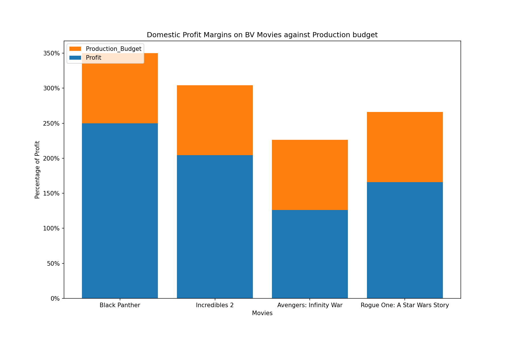

# Microsoft Studio Needs Competition Analysis

### Contributing Members: [Nicholus Magak](NicholusMagak:nicholusmagak@gmail.com)

## Project Overview

For this project, you will use exploratory data analysis to generate insights for a business stakeholder.

### Business Problem

Microsoft wants to create original video content, just as other big companies.
Their way forward was to create a new movie studio, but, they don't know how to make movies.

Find the films that are doing the best in the box office, then relay the findings in potential actions the head of the new studio can use to decide what type of films to create.

### The Data

The data used in this analysis was from the datasets provided in the folder `zippedData`. The choosen datasets were:
- bom movie_gross
- tn movie_budgets
- tmdb movies
- Both rt movie info and reviews
- imdb title [principals, and ratings]

## Deliverables

Throughout the analyses, the question I attempted to answer were:
- Which movies were the most profitable?
- Which genres are the most favored/ watched/ reviewed?
- Do higher order actors affect the movie likeability?

### Q1: Which movies were the most profitable?
I used the tn movie budgets to calculate the movies that were most profitable, for both domestic and foreign margins.

    tnBudget_Calc['domestic_margins'] = tnBudget_Calc['domestic_gross'] - tnBudget_Calc['production_budget']

    tnBudget_Calc['worldwide_margins'] = tnBudget_Calc['worldwide_gross'] - tnBudget_Calc['production_budget']

My opinion to do this was to emulate the studio with the most profit on both the foreign and domestic market. Hence, with the margin obtained, the solution was to filter out the data in order to obtain the most common highest earning studio.
This was BV Studio.

Once that was ensured, the same most profitable movies from BV were compared amongst each other on a bar plot, showing the most successful and least successful from the lot.

### Answer(Q1): When both most successful movies from BV in foreign and domestic regions were placed together, I found the average of the budget and, if Microsoft is to make a big impact on the market then their production budget should be around $175,000,000

### Q2: Which genres are the most favored/ watched/ reviewed?
Information from Rotten tomatoes is put together to get genres that are most likely best for viewers based on the number of movies that are highly rated within that genre.

    rtMerged = pd.merge(rtMovie_Info_df, rtReviews_df, left_on='id', right_on='id')
    rtMerged = rtMerged.loc[rtMerged['rating_y'] >= rtMerged['rating_y'].quantile(.9)]

    genres_grouping = (rtMerged.groupby('genre', as_index=False).count())[['genre','id']].sort_values(by=['id'], ascending=False)
    genres_grouping.head(10)

The goupby uniquely groups the genres which are sorted by the movie ids which are then counted to provide proof of which genre contains the most movie reviews. This would mean that the most reviewed/ rated genre would be the most viewed genre from the data, knowing that we don't have a column that has the actual number of people who have watched but rather voted.

### Answer(Q2): The way forward is to focus on the Drama genre in order to reach the most views possible because because they are the most rated per view.

### Q3: Do higher order actors affect the movie likeability?
Now that we have seen that genre which is most likely going to be watched, another pressing concern would be which actors should Microsoft Studios end up hiring as part of the cast? The reason I went forward with was that we need to check the number of votes for movies that contain the more high order actors and actresses.

    aaaDf = imdbTitle_Principals_df.loc[((imdbTitle_Principals_df['category'] == 'actor') | (imdbTitle_Principals_df['category'] == 'actress')) & (imdbTitle_Principals_df['ordering'] <= 2)]

From the plot above, it is visible that the movies that had more high order characters in them had more votes and therefore, more views. The thought process is that when there are more familiar characters in a movie, then, the audience is more likely to watch them.

On top of that, I also wanted to find out if more reviews in a movies would likely mean that it is good and viewers recommend movies they like to each other. This can be seen from the plot below which show how the more likeable movie had the most amount of reviews and votes.

### Answer(Q3): The view would be that Microsoft Studios should look into getting more familiar characters in a movie. This will end up exciting its audience causing the movie to get more views and overall ratings.

